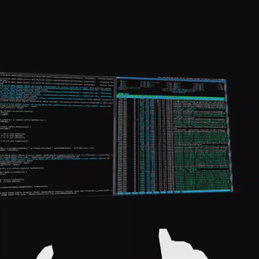

# XrScreenMirror
XrScreenMirror is a simple tool to mirror the desktop window to a VR headset. It's designed to be used with the OpenXR runtime.

Build with [XRLib_Renderer](https://github.com/AoGao-Kedoka/XRLib_Renderer)



## Build
```
mkdir build && cd build
cmake ..
cmake --build .
```
